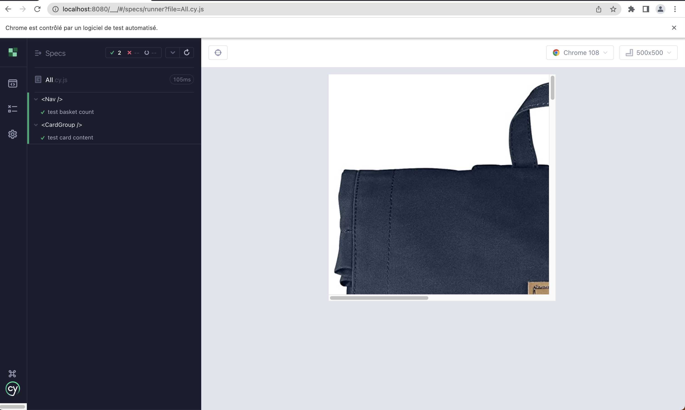

# Cypress React Unit Test

First you need yarn installed in your local machine

Install dependencies with: yarn install

To starh the server run: yarn start

Visit localhost:3000

To execute the cypress test: yarn cypress open-ct

Component testing

E2E testing

